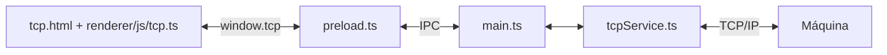

# Testes de comunicação TCP/IP

Esta parte do projeto permite conectar o aplicativo à máquina e visualizar os
bytes que ela envia. O aplicativo funciona como **cliente TCP**: a máquina deve
aceitar conexões no IP e na porta informados. Nesta versão, nenhum comando é enviado.

## Estrutura de arquivos

Os caminhos abaixo partem da raiz do projeto.

```text
src/
├── main/main.ts
├── preload/preload.ts
├── modules/tcp/services/tcpService.ts
├── modules/tcp/sessions/tcpSession.ts
├── modules/tcp/types/tcpTypes.ts
└── renderer/
    ├── views/home.html
    ├── views/tcp.html
    └── js/tcp.ts
scripts/
├── copyAssets.cjs
└── testTcp.cjs
```

| Arquivo | Responsabilidade |
| --- | --- |
| [home.html](../../src/renderer/views/home.html) | Contém o acesso **TESTE TCP** na barra inferior. |
| [views/tcp.html](../../src/renderer/views/tcp.html) | Define os campos de IP e porta, os botões e a área de registros. |
| [js/tcp.ts](../../src/renderer/js/tcp.ts) | Captura os eventos da tela, solicita conexão e desconexão, atualiza o status e apresenta os dados recebidos. |
| [preload.ts](../../src/preload/preload.ts) | Expõe `window.tcp` à interface usando `contextBridge`. Faz a ponte com o processo principal, sem expor o acesso direto ao socket. |
| [main.ts](../../src/main/main.ts) | Mantém o serviço e a sessão TCP durante a navegação, recebe solicitações e devolve eventos. Encerra a conexão ao fechar a janela. |
| [tcpSession.ts](../../src/modules/tcp/sessions/tcpSession.ts) | Guarda os últimos 200 registros, contador, parâmetros e status para restaurar a tela, inclusive os dados recebidos enquanto a home está aberta. |
| [tcpService.ts](../../src/modules/tcp/services/tcpService.ts) | Usa `Socket` do Node.js para conectar, receber bytes, tratar erros e desconectar. O limite para estabelecer a conexão é de 10 segundos. |
| [modules/tcp/types/tcpTypes.ts](../../src/modules/tcp/types/tcpTypes.ts) | Define os tipos `TcpOptions`, `TcpEvent`, `TcpSessionEvent` e `TcpSnapshot`, compartilhados entre as partes da aplicação. |
| [testTcp.cjs](../../scripts/testTcp.cjs) | Testa o serviço com conexões locais, sem depender da máquina física ou abrir o Electron. |
| [copyAssets.cjs](../../scripts/copyAssets.cjs) | Copia HTML, CSS e demais arquivos da interface para `dist` após a compilação do TypeScript. |

## Caminho da comunicação

Os dados compartilhados ficam em `src/modules/tcp/types/tcpTypes.ts`.
O contrato de operações expostas pelo preload fica em
`src/modules/tcp/contracts/tcpApiContract.ts` (`TcpApiContract`).
A declaração de `window.tcp` pertence ao renderer e fica em
`src/renderer/types/window.d.ts`. Interfaces de dados continuam em `types`;
contratos de comportamento ficam em `contracts`.



IPC é a troca de mensagens entre os processos do Electron. Os canais usados são:

| Canal | Uso |
| --- | --- |
| `tcp:connect` | A interface solicita uma conexão, passando `host` e `port`. |
| `tcp:disconnect` | A interface solicita o encerramento da conexão. |
| `tcp:event` | O processo principal informa mudanças de status e dados recebidos. |
| `tcp:getState` | Recupera o histórico, contador e estado atual da conexão ao abrir a tela. |
| `tcp:clearLog` | Limpa o histórico e o contador mantidos no processo principal, sem desconectar. |

Ao clicar em **Conectar**, a tela chama `window.tcp.connect()`. O preload encaminha
a solicitação ao processo principal, que chama `TcpService.connect()`.
A conclusão dessa solicitação indica que a tentativa começou; a conexão é
confirmada posteriormente por um evento de status.

Quando chegam bytes, o serviço produz um `TcpEvent`. O processo principal envia
esse evento pelo canal `tcp:event`, e a tela o recebe por `window.tcp.onEvent()`.

## Formato dos eventos

| Campo | Conteúdo |
| --- | --- |
| `kind` | `status` para mudanças da conexão ou `data` para dados recebidos. |
| `message` | Descrição do status ou texto decodificado em UTF-8. |
| `time` | Horário do evento em formato ISO. |
| `connected` | Indica se o serviço considera a conexão estabelecida. |
| `hex` | Bytes em hexadecimal, presente nos eventos de dados. |
| `bytes` | Quantidade de bytes do bloco recebido. |

TCP entrega um fluxo de bytes. Um bloco recebido pode conter parte de uma mensagem
ou várias mensagens juntas. O serviço usa `StringDecoder` para preservar caracteres
UTF-8 divididos entre blocos, mas ainda não separa nem interpreta mensagens do
protocolo da máquina. Para inspecionar dados binários, use a representação hexadecimal.

## Testar com a máquina

1. Inicie o aplicativo com `npm.cmd start` ou abra um executável atualizado.
2. Na barra inferior da home, clique em **TESTE TCP**.
3. Informe o IP e a porta em que a máquina aceita conexões TCP.
4. Clique em **Conectar** e acompanhe o status e os registros.
5. Clique em **Desconectar** ao terminar.

O computador precisa alcançar a máquina pela rede; acesso à internet não é necessário.
Se houver conexão, mas nenhum registro, confirme se a máquina envia dados espontaneamente.
Equipamentos que exigem um comando de consulta precisarão dessa integração posteriormente.

### Salvar os registros em TXT

Clique em **SALVAR TXT** e escolha o nome e a pasta do arquivo. O texto é salvo
em UTF-8 e contém a data da exportação, o contador de bytes e os registros
visíveis de status, texto e hexadecimal. É possível salvar durante a conexão
ou após desconectar.

A exportação captura os registros no momento do clique e respeita o limite da
tela: até 200 registros e as prévias de blocos longos. Não é uma gravação contínua
de todos os dados da sessão. Salve antes de limpar os registros ou fechar o aplicativo.

### Navegação entre telas

Voltar à home mantém a conexão ativa. Ao retornar ao teste TCP, os campos,
registros, contador e status são restaurados. Dados recebidos enquanto a home
está aberta também entram no histórico. Os eventos têm uma sequência para evitar
duplicações durante a restauração. Campos ainda não enviados são guardados no
`sessionStorage` da janela. A persistência dura enquanto a janela estiver aberta.

O botão chama `window.tcp.saveLog()`, exposto pelo preload. O canal IPC
`tcp:saveLog` abre a janela de salvamento e grava o arquivo no processo principal.

## Executar os testes automatizados

Na raiz do projeto, com as dependências instaladas:

```powershell
npm.cmd run test:tcp
```

O comando compila o projeto e executa `scripts/testTcp.cjs` com o executor de testes
do Node.js. Os testes usam `127.0.0.1` e portas temporárias escolhidas pelo sistema.

São verificados quatro cenários:

1. Recepção de bytes binários e de um caractere UTF-8 dividido entre blocos,
   incluindo o encerramento da conexão pelo servidor.
2. Rejeição de endereço vazio e porta inválida.
3. Comunicação de erro quando a conexão é recusada.
4. Retenção do estado da sessão, limite de histórico e limpeza sem perder a conexão.

Esses testes verificam o serviço TCP. Eles não validam a interface visual, a ponte
IPC nem o protocolo ou a conexão com a máquina real.

## Limites da versão inicial

- O aplicativo conecta como cliente; não aguarda conexões iniciadas pela máquina.
- Não há envio de comandos nem reconexão automática.
- O histórico fica na memória, limitado a 200 registros. A prévia de texto usa
  até 4.096 unidades de string, e a de hexadecimal mostra até 4.096 bytes por bloco.
- O contador soma todos os bytes recebidos, mesmo quando a prévia é limitada.
- **Limpar registros** apaga o histórico e zera o contador, sem desconectar.
- Os dados recebidos ainda não alimentam os indicadores da home, que continuam simulados.

## Onde alterar

- **Layout e campos:** `src/renderer/views/tcp.html`.
- **Exibição dos dados e ações dos botões:** `src/renderer/js/tcp.ts`.
- **Conexão e tratamento dos bytes:** `src/modules/tcp/services/tcpService.ts`.
- **Novas operações disponíveis à interface:** tipos em `src/modules/tcp/types/tcpTypes.ts`,
  ponte em `src/preload/preload.ts` e handlers em `src/main/main.ts`.
- **Novos cenários de validação do serviço:** `scripts/testTcp.cjs`.

Edite os arquivos em `src`. A pasta `dist` contém os arquivos gerados pelo build.
